# Write-Claw

<div align="center">
  <p>
    
    
    
    
  </p>

  <h3>✨ A claw-native workspace for long-form AI writing, runtime visibility, editable memory, and chapter checkpoints.</h3>

  <p>
    💡 Write-Claw is built for writers and builders who want more than “prompt in, text out”.
  </p>

  <p>
    <a href="./README.zh-CN.md"></a>
    <a href="./local_web_portal/start_local.ps1"></a>
    <a href="./local_web_portal/README.md"></a>
    <a href="./EXPORT_WHITELIST.md"></a>
  </p>

  <p>
    <a href="#overview">Overview</a> |
    <a href="#visual-tour">Visual Tour</a> |
    <a href="#why-it-feels-different">Why It Feels Different</a> |
    <a href="#quick-start">Quick Start</a> |
    <a href="#integrations">Integrations</a> |
    <a href="#repository-layout">Repository Layout</a>
  </p>
</div>

<p align="center">
  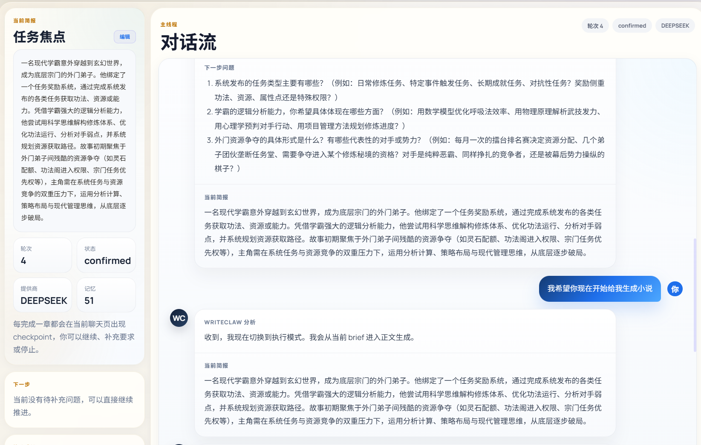
</p>

> 🚀 **Local-First Demo**
> Run **[`.\local_web_portal\start_local.ps1`](./local_web_portal/start_local.ps1)** to launch the portal locally at `http://127.0.0.1:8010`.

## Overview 🌟

`Write-Claw` is a runtime-focused workspace for long-form AI writing. Instead of presenting writing as a single prompt exchange, it combines a local web portal, a Claw-style orchestration loop, editable memory surfaces, chapter checkpoints, and visible execution trace into one continuous authoring environment.

It is especially useful for people who want:

- 📚 chapter-level control rather than one-shot generation
- 👀 visible runtime state instead of black-box output only
- 🧠 editable memory panels for character state, world facts, and revision notes
- 🤝 human-in-the-loop writing where interruption and steering are part of the workflow
- 🛠️ reusable host packages for Claude and Codex

<table>
  <tr>
    <td width="33%" valign="top">
      <h3>👀 Visible Runtime</h3>
      <p>Watch the active loop, current step flow, and writing progress instead of guessing what the system is doing.</p>
    </td>
    <td width="33%" valign="top">
      <h3>🧠 Editable Memory</h3>
      <p>Keep character state, world state, notes, and continuity assets on editable surfaces that can evolve over time.</p>
    </td>
    <td width="33%" valign="top">
      <h3>📍 Chapter Checkpoints</h3>
      <p>Treat every chapter as a checkpoint where the author can pause, inspect, redirect, and continue.</p>
    </td>
  </tr>
</table>

## Visual Tour 👀

<table>
  <tr>
    <td width="50%" valign="top">
      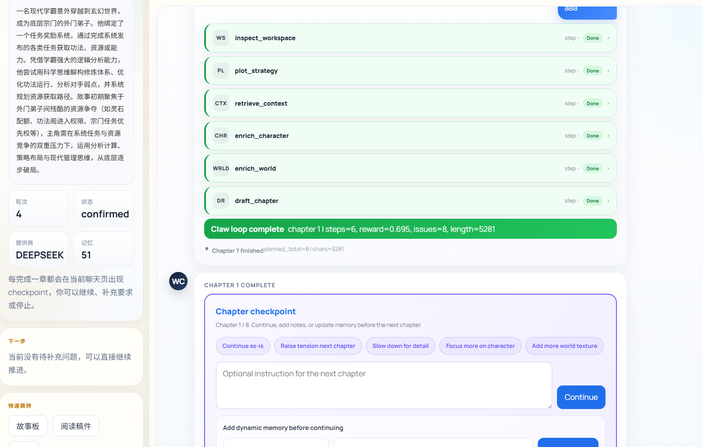
    </td>
    <td width="50%" valign="top">
      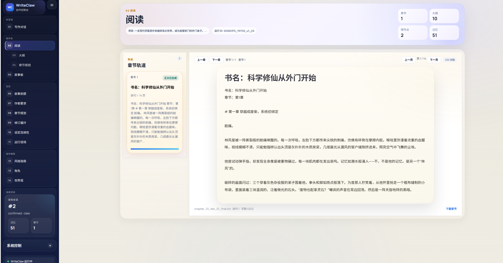
    </td>
  </tr>
</table>

Write-Claw is designed around a simple idea: AI writing should be inspectable, interruptible, revisable, and memory-aware from start to finish. ✨

## Why It Feels Different ✨

| Typical writing tool | Write-Claw |
|---|---|
| Mostly shows final text output | Shows runtime trace, steps, checkpoints, and workspace state |
| Writing feels like one long chat | Writing feels like a managed workspace with chapter progression |
| Memory is hidden or implicit | Memory panels, notes, and state can stay visible and editable |
| Hard to pause and redirect | Built for interruption, steering, and checkpoint decisions |
| Limited host reuse | Includes Claude and Codex distribution bundles |

### Core Experience 🧩

| Surface | What it gives you |
|---|---|
| `Runtime Loop` | A live Claw-style orchestration loop with visible execution flow |
| `Writing Console` | One place for chat, progress, manuscript work, and current run state |
| `Memory Surface` | Panels for canon, character state, world facts, and revision notes |
| `Workspace Tools` | Planning, sync, retrieval, revision, and chapter operations in one workspace |

## Interface Gallery 🖼️

### Runtime and Progress

<table>
  <tr>
    <td width="33%">
      
      <p align="center"><sub>Live runtime trace</sub></p>
    </td>
    <td width="33%">
      
      <p align="center"><sub>Main writing surface</sub></p>
    </td>
    <td width="33%">
      
      <p align="center"><sub>Chapter progress flow</sub></p>
    </td>
  </tr>
</table>

### Assets and Story Workspace

<table>
  <tr>
    <td width="33%">
      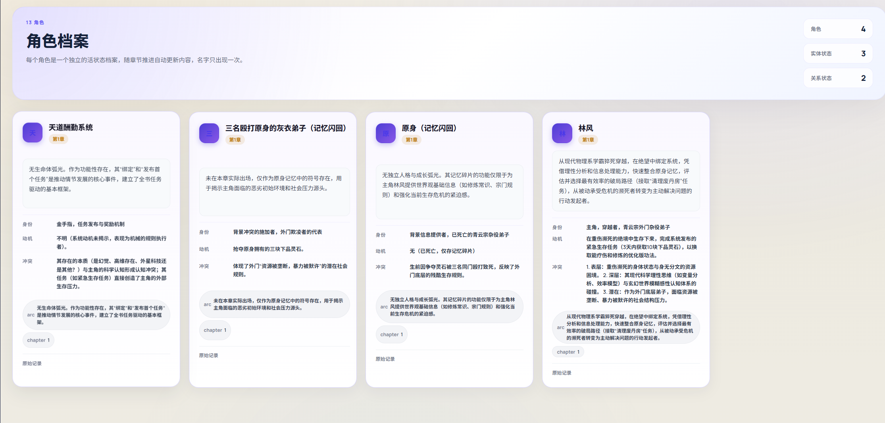
      <p align="center"><sub>Character archive</sub></p>
    </td>
    <td width="33%">
      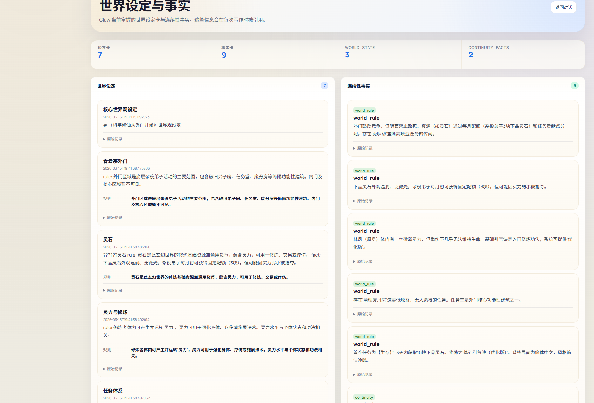
      <p align="center"><sub>World and context view</sub></p>
    </td>
    <td width="33%">
      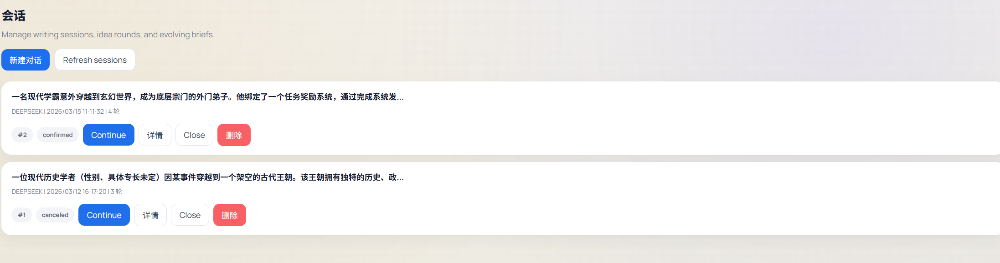
      <p align="center"><sub>Storyboard workspace</sub></p>
    </td>
  </tr>
</table>

### Memory, Editing, and Control

<table>
  <tr>
    <td width="33%">
      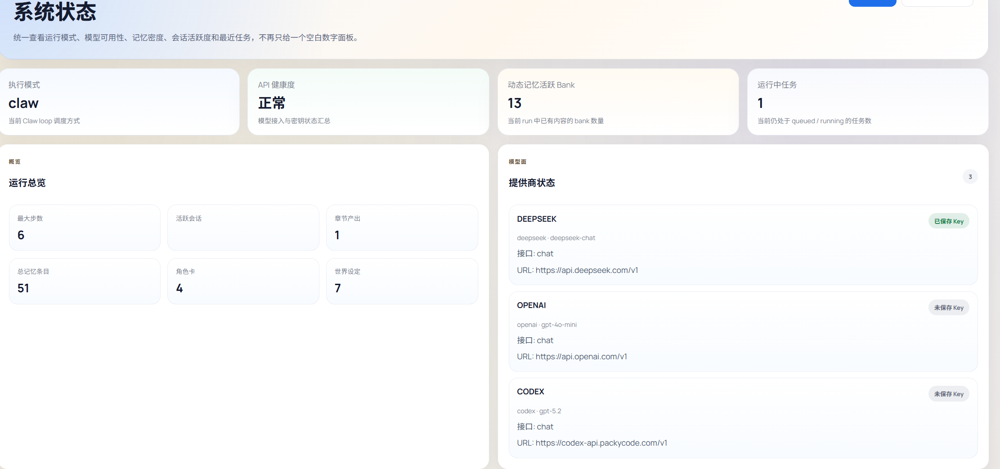
      <p align="center"><sub>Memory overview</sub></p>
    </td>
    <td width="33%">
      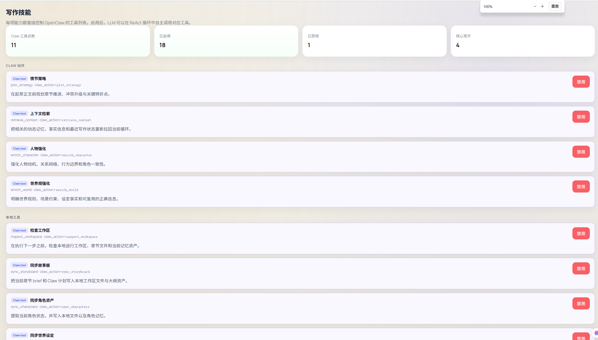
      <p align="center"><sub>Editable workspace detail</sub></p>
    </td>
    <td width="33%">
      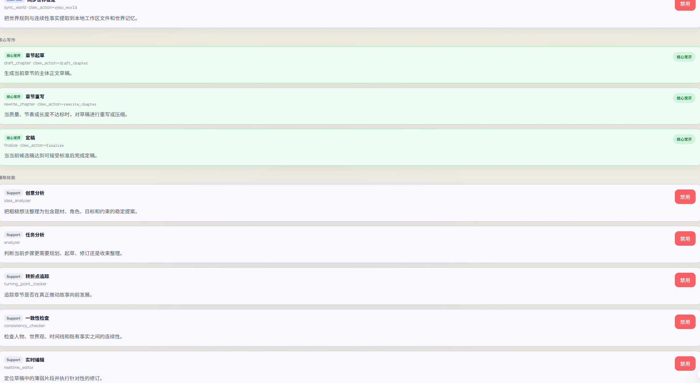
      <p align="center"><sub>Capability control</sub></p>
    </td>
  </tr>
</table>

<details>
<summary><b>More Screenshots</b></summary>

<table>
  <tr>
    <td width="33%">
      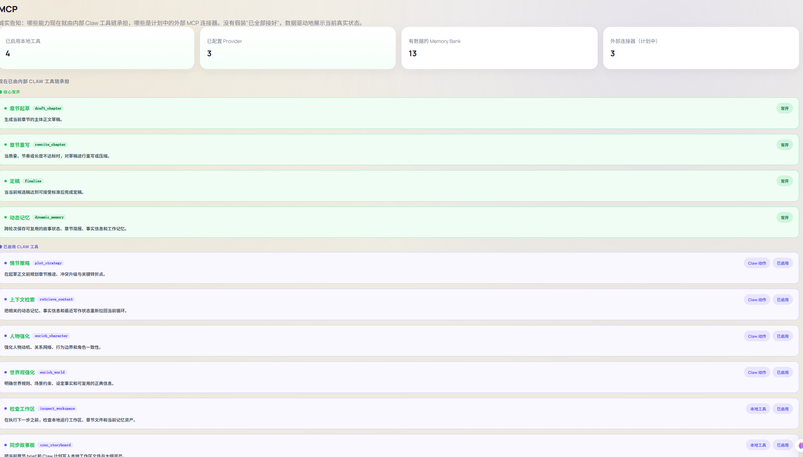
      <p align="center"><sub>Model settings</sub></p>
    </td>
    <td width="33%">
      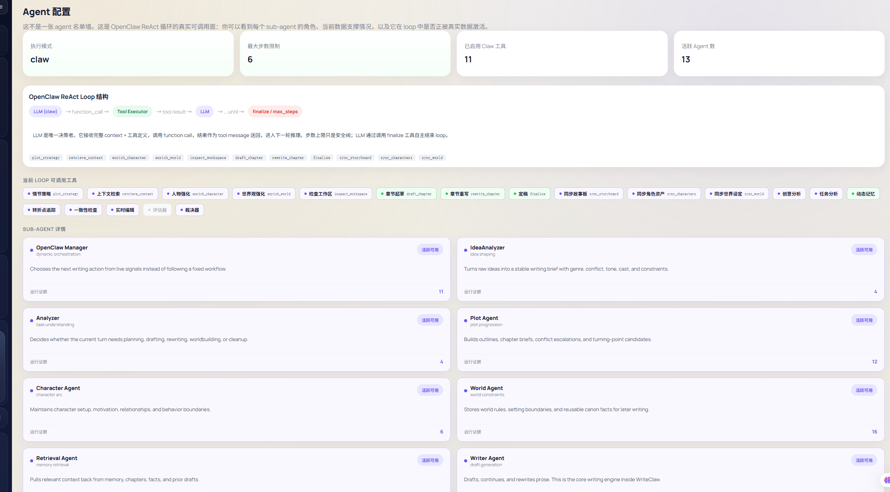
      <p align="center"><sub>Session center</sub></p>
    </td>
    <td width="33%">
      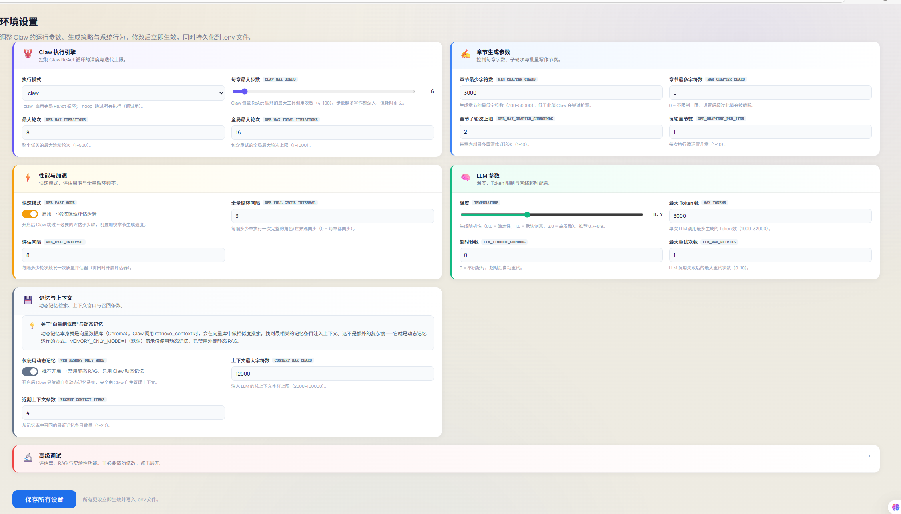
      <p align="center"><sub>Status and trace</sub></p>
    </td>
  </tr>
  <tr>
    <td width="33%">
      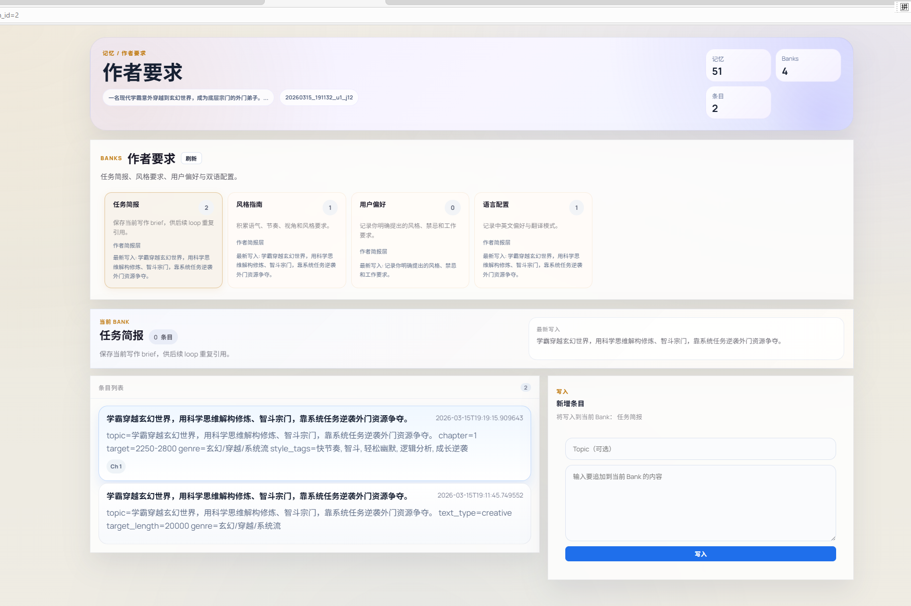
      <p align="center"><sub>Skills and agents</sub></p>
    </td>
    <td width="33%">
      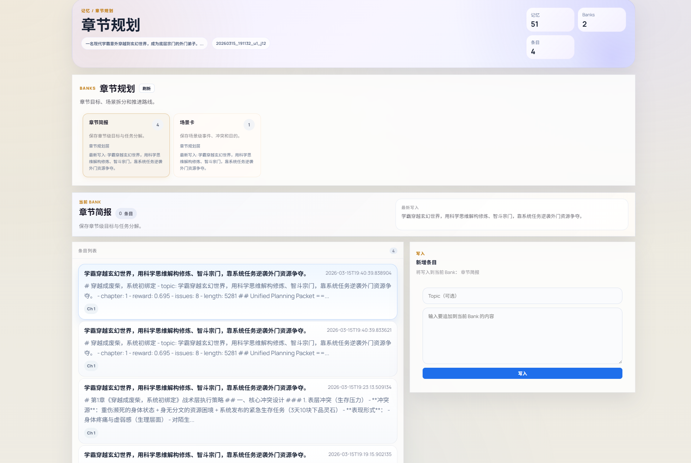
      <p align="center"><sub>Writing workspace</sub></p>
    </td>
    <td width="33%">
      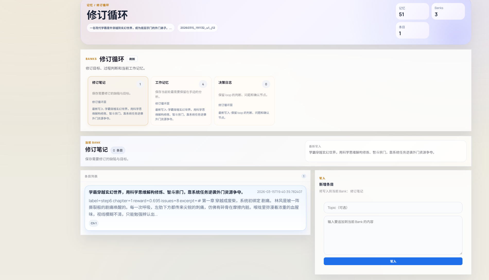
      <p align="center"><sub>System capability stack</sub></p>
    </td>
  </tr>
</table>

</details>

## Who It Is For 🎯

- ✍️ writers who want chapter-by-chapter control
- 🤖 developers exploring agents, tools, memory systems, and visible orchestration
- 🔬 researchers working on long-form writing, runtime interaction, and human-in-the-loop systems

## Quick Start 🚀

<details open>
<summary><b>🌐 Option A: Launch the Local Web Portal</b></summary>

Recommended:

```powershell
.\local_web_portal\start_local.ps1
```

What this script does:

- ✅ creates `.venv` if it does not exist
- ✅ installs root and portal dependencies
- ✅ creates `local_web_portal\.env` from `.env.example` if needed
- ✅ starts the app on `127.0.0.1:8010`

Open:

```text
http://127.0.0.1:8010
```

</details>

<details>
<summary><b>⌨️ Option B: Manual Setup</b></summary>

```powershell
python -m venv .venv
.\.venv\Scripts\Activate.ps1
python -m pip install --upgrade pip setuptools wheel
python -m pip install -r requirements.txt
python -m pip install -r local_web_portal\requirements.txt
Copy-Item local_web_portal\.env.example local_web_portal\.env
python -m uvicorn local_web_portal.app.main:app --host 127.0.0.1 --port 8010
```

</details>

### Default Export Behavior

The GitHub export is configured to boot in model-free workspace mode by default:

```text
WEB_MODELLESS_MODE=1
DISABLE_EMBEDDING_DOWNLOADS=1
```

This means:

- 🌐 the portal can boot without provider configuration
- 🔐 startup, login, workspace browsing, and local state inspection do not require API keys
- 📦 RAG embedding downloads are disabled during export-oriented runs
- 🧪 model-driven generation stays off until you explicitly switch `WEB_MODELLESS_MODE=0`

### Timeout Settings

If you want long jobs to run without timeout cutoffs, keep these in `local_web_portal\.env`:

```text
WEB_JOB_TIMEOUT_SECONDS=0
WEB_JOB_IDLE_TIMEOUT_SECONDS=0
LLM_TIMEOUT_SECONDS=0
```

## Deployment Notes 🛠️

### Local Portal

- use `.\local_web_portal\start_local.ps1` for the fastest local path
- use `python -m uvicorn local_web_portal.app.main:app --host 127.0.0.1 --port 8010` if you want to start manually
- avoid `--reload` during long generation runs unless you are actively editing code

### Server Deployment

Minimal production-style command:

```bash
uvicorn local_web_portal.app.main:app --host 0.0.0.0 --port 8010 --workers 2
```

Recommended environment variables:

- `APP_SESSION_SECRET`
- `APP_ENCRYPTION_KEY`
- `APP_HTTPS_ONLY=1`
- `APP_DATABASE_URL` for PostgreSQL in multi-user deployments

See [local_web_portal/README.md](./local_web_portal/README.md) for portal-specific deployment details.

## Integrations 🔌

Write-Claw includes two host-specific reuse paths:

- `integrations/claude-plugin-bundle`
  Claude-oriented plugin bundle using a `.claude-plugin` layout
- `integrations/codex-skill-bundle`
  Codex-oriented skill bundle using `AGENTS.md` and `.codex/skills`

These packages do **not** require MCP.

Use them directly when you mainly need:

- reusable prompts
- chapter workflow structure
- memory and continuity conventions
- host-specific installation layout

Add MCP later only if you want a shared tool-calling layer for runtime control, memory access, or chapter synchronization.

## Release Bundles 📦

Prepacked release artifacts are already included:

- [release/write-claw-claude-plugin.zip](./release/write-claw-claude-plugin.zip)
- [release/write-claw-codex-skill.zip](./release/write-claw-codex-skill.zip)
- [release/release-notes-v0.1.0.md](./release/release-notes-v0.1.0.md)

If you publish GitHub Releases, these two zip files are the recommended upload assets.

## Repository Layout 🗂️

```text
Write-Claw/
|-- agents/                # agent implementations
|-- rag/                   # memory and retrieval
|-- utils/                 # shared helpers
|-- workflow/              # orchestration and execution
|-- local_web_portal/      # FastAPI portal and startup scripts
|-- integrations/          # Claude / Codex reusable bundles
|-- release/               # packaged release assets
|-- png/                   # README screenshots
|-- capability_registry.py # capability definitions
|-- config.py              # configuration center
|-- main.py                # main runtime entry
`-- requirements.txt       # dependencies
```

## Documentation 📚

- 🇨🇳 Chinese docs: [README.zh-CN.md](./README.zh-CN.md)
- 🌐 Portal guide: [local_web_portal/README.md](./local_web_portal/README.md)
- 📦 Export whitelist: [EXPORT_WHITELIST.md](./EXPORT_WHITELIST.md)
- 🔌 Integrations: [integrations/README.md](./integrations/README.md)
